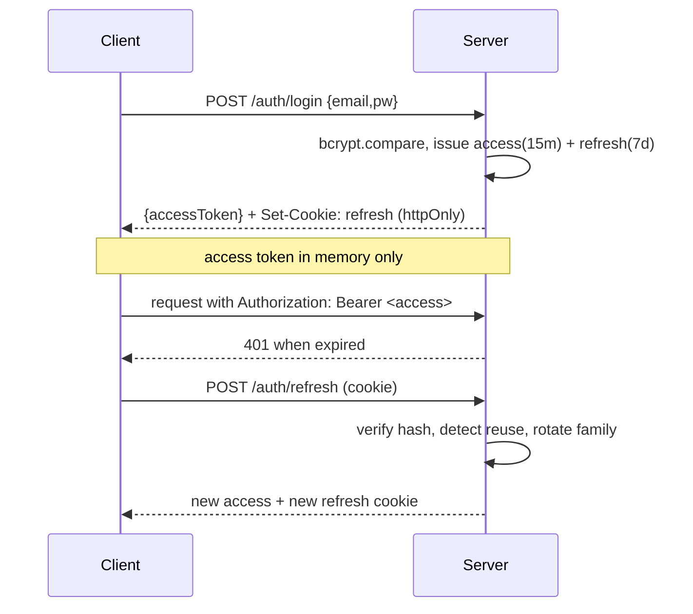
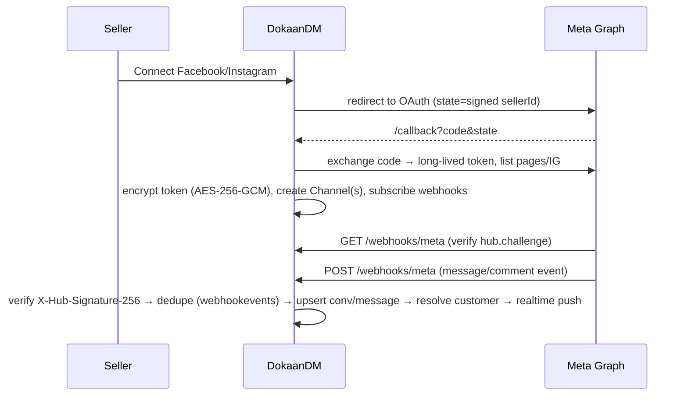
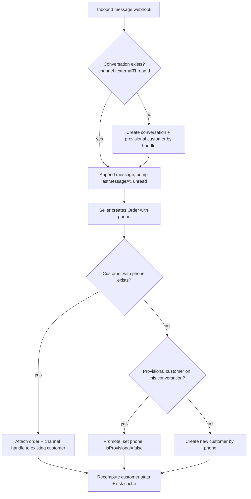

# DokaanDM — Product Specification (MVP v1)

> **Omnichannel Inbox · Order Capture · Lightweight CRM for Nepali Social Commerce Sellers**
>
> This document is the single source of truth for the MVP build. It is derived from `MVP_Development_Plan` and `pricing plan.md`. It defines the feature-level functional requirements, the complete MongoDB data model, the full API surface (which doubles as the Swagger source of truth), the core app flows, and how pricing-tier limits are enforced at the data/API layer.
>
> **Scope discipline:** This spec covers **only** the v1 MVP. WhatsApp, TikTok, AI auto-reply, payment-gateway integration (eSewa/Khalti), and storefront/website features are explicitly **out of scope** and are not modelled here except where a forward-compatible field costs nothing to reserve.

---

## 0. Naming & Positioning

- **Working product name:** **DokaanDM** — "Dokaan" (दोकान, _shop_) + "DM" (direct message). Keeps the working name from the brief; it reads clearly in the Nepali market and ties the shop identity to the DM channel that is the actual battleground. Kept unless the founder prefers an alternative.
- **One-line positioning:** _Meets sellers where they already sell — Facebook & Instagram DMs — and does the two things a storefront-first tool under-serves: fast order capture and remembering the customer._
- **Primary surface:** Responsive web app. Flutter mobile companion is future scope, not part of this build.

---

## 1. Feature Breakdown (Functional Requirements & User Flows)

Each feature is written as concrete, testable functional requirements (FR-#) plus the primary user flow. Priority tags mirror the MVP doc.

### 1.0 Authentication & Seller Account (foundational)

**FR-A1** A seller can register with full name, business name, email, phone, and password. Email is unique per tenant.
**FR-A2** Passwords are hashed with bcrypt (cost ≥ 12). Plaintext/hashes are never returned or logged.
**FR-A3** Login issues a short-lived JWT access token (~15 min) and sets an httpOnly, Secure, SameSite refresh-token cookie (~7 days) with rotation on each refresh.
**FR-A4** A refresh token can be revoked (logout) and is invalidated server-side; reuse of a rotated/consumed refresh token revokes the whole token family (reuse detection).
**FR-A5** Every new seller is assigned the **Free** plan by default with `planStatus: active`.
**FR-A6** All data access is tenant-scoped: a query without the authenticated `sellerId` in its filter is a bug. Cross-tenant reads/writes must be provably impossible (integration test enforced).
**FR-A7** Auth endpoints are rate-limited (login, register, refresh, forgot-password).

**Flow — Registration → first login**
1. Seller submits register form → server validates (Zod) → creates `Seller` (Free plan) → returns access token + sets refresh cookie.
2. Client stores access token in memory (not localStorage), refresh handled via cookie.
3. On access-token expiry, client silently calls `/auth/refresh`; on failure, redirect to login.

---

### 1.1 Feature 1 — Unified Inbox (Facebook + Instagram) · **MUST HAVE**

A single chronological, searchable inbox merging Facebook Page Messenger DMs, Facebook Page comments, and Instagram Business DMs/comments into one thread list. Replies are sent back through the native Meta channel.

**FR-I1** A seller connects a Facebook Page and/or Instagram Business account via Meta OAuth 2.0 (Facebook Login for Business, authorization-code flow).
**FR-I2** Incoming messages and comments arrive via Meta **webhooks** (near real-time), not polling. A reconciliation/backfill sync fills gaps on connect and on demand.
**FR-I3** Conversations are normalized so FB and IG threads render identically: `{ channel, externalThreadId, contactRef, messages[] }`.
**FR-I4** The thread list shows: contact display name/handle, channel badge (FB / IG, comment vs DM), last-message snippet, timestamp, unread indicator, and a "linked customer / linked order" indicator.
**FR-I5** Selecting a thread opens the message pane: full chronological history, inbound/outbound distinction, delivery/send status, and a reply composer.
**FR-I6** Sending a reply posts through the Meta Graph API to the correct channel; UI updates optimistically and reconciles on webhook/API confirmation. Failures surface a retry affordance.
**FR-I7** Threads have read/unread state per seller; opening marks read; a filter toggles unread-only.
**FR-I8** Full-text search across contact name/handle and message body, scoped to the seller.
**FR-I9** Filters: channel (FB/IG), type (DM/comment), status (unread/all), and "has order".
**FR-I10** Outbound messages respect Meta's **200 automated messages/hour/account** cap via a queue with backoff; over-cap sends are queued, not dropped, and surfaced as "queued".
**FR-I11** Keyboard-first: `j/k` move between threads, `Enter` open, `r` focus reply, `⌘/Ctrl+Enter` send, `e` archive/mark-read, `/` focus search.
**FR-I12** Webhook payloads are signature-verified (`X-Hub-Signature-256`); unverified payloads are rejected and logged.

**Flow — New message → reply**
1. Customer DMs the seller's IG business account.
2. Meta posts a webhook event → server verifies signature → resolves the `Channel` by page/IG id → upserts `Conversation` + `Message` → resolves/creates `Customer` by channel handle → emits realtime event to the seller's client.
3. Client shows a toast ("New message from @handle") and bumps the thread to top with unread dot.
4. Seller opens thread, types reply, hits send → optimistic append → server enqueues Graph API send (rate-limit aware) → on success, message status → `sent`.

---

### 1.2 Feature 2 — Order Capture From a Conversation · **MUST HAVE**

Turn any conversation into a structured order in a few taps, then track it through a status pipeline.

**FR-O1** From a conversation, "Create Order" opens a form pre-filled where possible (customer name/handle, channel, linked conversation).
**FR-O2** Order fields: line items (product name, qty, unit price), customer phone (required — the identity key), delivery address, payment type (`cod | esewa | khalti | bank_transfer`), payment reference (optional), notes. Totals auto-compute.
**FR-O3** Status pipeline: `pending → confirmed → shipped → delivered → returned` (plus `cancelled`). Transitions are validated (no illegal jumps) and each change is audit-logged.
**FR-O4** Orders link relationally to a `Customer` (via phone identity resolution) and to the source `Conversation`, so order history rolls up per customer automatically.
**FR-O5** **No payment processing.** Payment type/reference are stored fields only, for the seller's own reconciliation.
**FR-O6** Pipeline UI: kanban board (drag between stages) **and** list view with status filter. (Free tier gets list-only "basic"; paid tiers get full kanban + filters — see §5.)
**FR-O7** Every order belongs to exactly one seller; order numbers are per-seller sequential + human-readable (e.g. `#DKN-000123`).
**FR-O8** Creating an order counts against the seller's monthly order quota (see §5); exceeding the quota is blocked with an upgrade prompt.

**Flow — Conversation → order → delivered**
1. Seller clicks "Create Order" in a thread → form pre-fills handle/channel → seller enters product, qty, price, phone, address, payment type.
2. On submit: quota check → resolve/attach `Customer` by phone → create `Order` (status `pending`) → link to conversation → audit log.
3. Order appears on the pipeline board under Pending; seller drags to Confirmed (COD risk badge shown at this step — see 1.4), then Shipped/Delivered as fulfillment proceeds.

---

### 1.3 Feature 3 — Customer Profiles / Lightweight CRM · **CORE DIFFERENTIATOR**

Every conversation and order resolves to a single customer profile keyed on phone number across channels.

**FR-C1** **Identity resolution:** phone number (normalized to E.164-ish `+977…`) is the primary match key. Channel handles (IG id, FB PSID) attach as secondary identifiers. Matching an order's phone to an existing customer merges into that profile; otherwise a new profile is created.
**FR-C2** When a webhook conversation has no phone yet, a provisional customer is created keyed on the channel handle; when an order later supplies a phone, the provisional profile is reconciled/merged into the phone-keyed profile (idempotent, no duplicate).
**FR-C3** Profile shows: name, phones, linked channel handles, full order history (rolled up), lifetime value, order/return counts, COD risk badge (1.4), free-text notes, tags.
**FR-C4** Tags: seller-defined labels with a few seeded presets (`VIP`, `risky`, `regular`, `wholesale`). Many-to-one on customer.
**FR-C5** Notes: free-text, timestamped, append-style with edit history captured in the audit log.
**FR-C6** **Reminders/follow-ups:** date-based tasks ("ping when new stock arrives") attached to a customer; due/overdue reminders surface on the dashboard home.
**FR-C7** Customer records count against the profile quota per plan (Free 25, Starter 500, Growth+ unlimited — see §5).
**FR-C8** Edits to customer data (notes, tags, phone, merge) are audit-logged.

**Flow — Repeat-customer recognition**
1. New DM arrives → channel-handle-keyed provisional customer created.
2. Seller captures an order with phone `+9779800000000`.
3. System finds an existing phone-keyed customer with that number → attaches the new channel handle + order to that profile; order history now shows "3rd order". Seller sees prior notes/tags immediately.

---

### 1.4 Feature 4 — COD Risk Flagging · **CORE DIFFERENTIATOR**

A rule-based risk signal shown before confirming a COD order, computed from the seller's **own** order history. No ML, no external data, no cross-seller blacklist (v2 candidates).

**FR-R1** For each customer, compute from that seller's orders: `totalOrders`, `deliveredOrders`, `returnedOrders` (returns + refusals), `returnRate = returned / (delivered + returned)` (guarded for divide-by-zero).
**FR-R2** Risk label rules (v1, deterministic and unit-tested):
   - `new` — fewer than `MIN_HISTORY` (default 2) completed orders → insufficient history.
   - `reliable` — ≥ `MIN_HISTORY` completed orders **and** `returnRate ≤ 0.15`.
   - `medium` — `0.15 < returnRate ≤ 0.35`.
   - `risky` — `returnRate > 0.35`, **or** ≥ 2 returns with ≤ 3 total orders.
   Thresholds are config constants so they can be tuned without code changes to the rule shape.
**FR-R3** The badge (`New / Reliable / Medium / Risky` with color) shows on the customer profile and inline in the order-confirmation step (when moving an order to `confirmed`, especially for `payment=cod`).
**FR-R4** The order-confirmation surface shows the underlying numbers (past orders, past returns, return %) so the label is explainable, not a black box.
**FR-R5** Risk is computed on read (derived) or via a lightweight cached field recomputed on order-status change; either way it is always consistent with current order data. **The scoring function is pure and unit-tested as a core differentiator.**
**FR-R6** COD risk flagging is a **paid** feature (hidden on Free per §5).

**Flow — Confirming a COD order**
1. Seller drags a Pending COD order → Confirmed.
2. UI intercepts with the customer's risk panel: `Risky — 4 orders, 2 returned (50%)`.
3. Seller confirms or cancels with full information.

---

### 1.5 Feature 5 — Order & Business Dashboard · **MUST HAVE**

An orientation home screen (not an analytics suite) reading aggregates over existing Orders/Customers data.

**FR-D1** Summary cards: today's orders (count + value), pending COD confirmations (count), orders needing follow-up / reminders due today, revenue this month.
**FR-D2** Revenue-over-time chart (last 30 days, daily buckets of delivered-order value).
**FR-D3** Lists: reminders due/overdue, most recent orders, pipeline stage counts.
**FR-D4** All figures are seller-scoped aggregation queries over `orders` and `customers`; no new data model.
**FR-D5** Dashboard is a **paid** feature (hidden on Free per §5).

**Flow — Morning orientation**
1. Seller logs in → dashboard loads → sees "5 orders today (NPR 12,400), 3 COD pending confirmation, 2 follow-ups due" → clicks a follow-up → jumps to that customer.

---

## 2. MongoDB Data Model (Mongoose)

Conventions: every tenant-owned document carries `seller` (ObjectId ref `Seller`, indexed). All documents have `createdAt`/`updatedAt` (Mongoose timestamps). Money is stored as integer **paisa** (NPR × 100) to avoid float errors; API serializes to rupees. Encrypted fields use AES-256-GCM at the application layer.

### 2.1 `sellers`
| Field | Type | Req | Default | Notes |
|---|---|---|---|---|
| `_id` | ObjectId | ✔ | auto | |
| `fullName` | String | ✔ | | trimmed |
| `businessName` | String | ✔ | | |
| `email` | String | ✔ | | lowercase, **unique index** |
| `phone` | String | ✖ | | |
| `passwordHash` | String | ✔ | | bcrypt, `select:false` |
| `plan` | String (enum `free|starter|growth|business`) | ✔ | `free` | |
| `planStatus` | String (enum `active|past_due|canceled`) | ✔ | `active` | payment out of scope; field reserved |
| `planRenewsAt` | Date | ✖ | | informational only in MVP |
| `orderCountThisPeriod` | Number | ✔ | 0 | rolling monthly counter for quota |
| `orderCountPeriodStart` | Date | ✔ | now | resets monthly |
| `role` | String (enum `owner|staff`) | ✔ | `owner` | team logins (Growth+) |
| `parentSeller` | ObjectId ref Seller | ✖ | null | staff belong to an owner tenant |
| `lastLoginAt` | Date | ✖ | | |
| `isActive` | Boolean | ✔ | true | |

Indexes: `{ email: 1 }` unique; `{ parentSeller: 1 }`.
**Tenant key:** staff resolve their effective tenant to `parentSeller ?? _id` (call it `tenantId`). Every other collection references that tenant via `seller`.

### 2.2 `refreshtokens`
| Field | Type | Req | Notes |
|---|---|---|---|
| `seller` | ObjectId | ✔ | indexed |
| `tokenHash` | String | ✔ | SHA-256 of the refresh token; never store raw |
| `family` | String | ✔ | rotation family id; reuse detection |
| `expiresAt` | Date | ✔ | **TTL index** |
| `revokedAt` | Date | ✖ | |
| `replacedBy` | String | ✖ | tokenHash of successor |
| `userAgent`, `ip` | String | ✖ | audit |

Indexes: `{ tokenHash: 1 }` unique; `{ expiresAt: 1 }` TTL; `{ seller:1, family:1 }`.

### 2.3 `channels` (a connected FB Page or IG Business account)
| Field | Type | Req | Default | Notes |
|---|---|---|---|---|
| `seller` | ObjectId | ✔ | | tenant |
| `type` | String (enum `facebook|instagram`) | ✔ | | |
| `externalId` | String | ✔ | | FB Page id / IG business account id |
| `name` | String | ✔ | | page/account display name |
| `pageAccessTokenEnc` | String | ✔ | | **AES-256-GCM encrypted** long-lived token |
| `tokenExpiresAt` | Date | ✖ | | for scheduled refresh |
| `igLinkedPageId` | String | ✖ | | IG's backing FB page |
| `webhookSubscribed` | Boolean | ✔ | false | |
| `status` | String (enum `active|disconnected|error`) | ✔ | `active` | |
| `scopes` | [String] | ✖ | | granted permissions |

Indexes: `{ seller:1, type:1 }`; `{ externalId:1, type:1 }` unique (a page maps to one channel); `{ seller:1, status:1 }`.

### 2.4 `customers`
| Field | Type | Req | Default | Notes |
|---|---|---|---|---|
| `seller` | ObjectId | ✔ | | tenant |
| `name` | String | ✖ | | best-known display name |
| `phones` | [String] | ✖ | [] | normalized `+977…`; **primary identity** |
| `channelIdentities` | [{ channel: ObjectId, type, externalUserId, handle }] | ✖ | [] | IG id / FB PSID secondary keys |
| `tags` | [String] | ✖ | [] | VIP, risky, regular… |
| `notes` | [{ body, createdAt, editedAt }] | ✖ | [] | |
| `isProvisional` | Boolean | ✔ | false | true until a phone is known |
| `riskCache` | { label, totalOrders, returnedOrders, returnRate, computedAt } | ✖ | | denormalized COD risk |
| `stats` | { totalOrders, lifetimeValuePaisa, lastOrderAt } | ✖ | | denormalized rollups |

Indexes (critical):
- `{ seller: 1, phones: 1 }` — **the identity-resolution index** (multikey; phone lookups within a tenant).
- `{ seller: 1, "channelIdentities.externalUserId": 1 }` — resolve provisional customers from webhook handles.
- `{ seller: 1, tags: 1 }`; `{ seller: 1, name: "text" }` for search.
- Partial unique guard on `{ seller:1, phones:1 }` is **not** enforced as unique (a phone may legitimately re-appear during merge windows); dedupe handled in the resolution service.

### 2.5 `conversations`
| Field | Type | Req | Default | Notes |
|---|---|---|---|---|
| `seller` | ObjectId | ✔ | | tenant |
| `channel` | ObjectId ref Channel | ✔ | | |
| `channelType` | String (`facebook|instagram`) | ✔ | | denormalized for fast filter |
| `kind` | String (enum `dm|comment`) | ✔ | `dm` | |
| `externalThreadId` | String | ✔ | | Meta conversation/thread/comment-root id |
| `customer` | ObjectId ref Customer | ✖ | | resolved participant |
| `participantHandle` | String | ✖ | | @handle / name |
| `participantExternalId` | String | ✖ | | PSID / IG user id |
| `lastMessageAt` | Date | ✔ | now | sort key |
| `lastMessageSnippet` | String | ✖ | | list preview |
| `unread` | Boolean | ✔ | true | |
| `unreadCount` | Number | ✔ | 0 | |
| `status` | String (enum `open|archived`) | ✔ | `open` | |
| `hasOrder` | Boolean | ✔ | false | filter flag |

Indexes:
- `{ seller:1, lastMessageAt:-1 }` — inbox list (primary paginated query).
- `{ channel:1, externalThreadId:1 }` unique — **webhook thread lookup / upsert**.
- `{ seller:1, unread:1, lastMessageAt:-1 }`; `{ seller:1, channelType:1, lastMessageAt:-1 }`; `{ customer:1 }`.

### 2.6 `messages`
| Field | Type | Req | Default | Notes |
|---|---|---|---|---|
| `seller` | ObjectId | ✔ | | tenant |
| `conversation` | ObjectId ref Conversation | ✔ | | indexed |
| `channelType` | String | ✔ | | |
| `direction` | String (enum `inbound|outbound`) | ✔ | | |
| `externalMessageId` | String | ✖ | | Meta message id (dedupe) |
| `text` | String | ✖ | | |
| `attachments` | [{ type, url }] | ✖ | [] | images etc. |
| `senderExternalId` | String | ✖ | | |
| `status` | String (enum `received|queued|sent|delivered|failed`) | ✔ | `received` inbound / `queued` outbound | |
| `error` | String | ✖ | | on failed send |
| `sentAt` | Date | ✖ | | |

Indexes: `{ conversation:1, createdAt:1 }` (thread render); `{ externalMessageId:1 }` unique-sparse (idempotent webhook); `{ seller:1, text:"text" }` search.

### 2.7 `orders`
| Field | Type | Req | Default | Notes |
|---|---|---|---|---|
| `seller` | ObjectId | ✔ | | tenant |
| `orderNumber` | String | ✔ | | per-seller sequential `#DKN-000123` |
| `customer` | ObjectId ref Customer | ✔ | | |
| `conversation` | ObjectId ref Conversation | ✖ | | source thread |
| `channelType` | String | ✖ | | origin channel |
| `items` | [{ productName, qty, unitPricePaisa }] | ✔ | | ≥1 |
| `subtotalPaisa` | Number | ✔ | | computed |
| `shippingPaisa` | Number | ✔ | 0 | |
| `totalPaisa` | Number | ✔ | | |
| `paymentType` | String (enum `cod|esewa|khalti|bank_transfer`) | ✔ | `cod` | logged only |
| `paymentReference` | String | ✖ | | reconciliation |
| `phone` | String | ✔ | | drives identity resolution |
| `address` | String | ✖ | | |
| `status` | String (enum `pending|confirmed|shipped|delivered|returned|cancelled`) | ✔ | `pending` | |
| `statusHistory` | [{ from, to, at, by }] | ✔ | [] | |
| `notes` | String | ✖ | | |

Indexes: `{ seller:1, createdAt:-1 }` (list); `{ seller:1, status:1, createdAt:-1 }` (pipeline); `{ customer:1, createdAt:-1 }` (history rollup); `{ seller:1, orderNumber:1 }` unique; `{ seller:1, paymentType:1, status:1 }` (COD-pending card).

### 2.8 `reminders`
| Field | Type | Req | Default | Notes |
|---|---|---|---|---|
| `seller` | ObjectId | ✔ | | tenant |
| `customer` | ObjectId ref Customer | ✖ | | optional link |
| `title` | String | ✔ | | |
| `dueAt` | Date | ✔ | | |
| `status` | String (enum `open|done`) | ✔ | `open` | |
| `completedAt` | Date | ✖ | | |

Indexes: `{ seller:1, status:1, dueAt:1 }` (dashboard due list); `{ customer:1 }`.

### 2.9 `activitylogs` (audit)
| Field | Type | Req | Notes |
|---|---|---|---|
| `seller` | ObjectId | ✔ | tenant |
| `actor` | ObjectId ref Seller | ✔ | who (owner/staff) |
| `action` | String | ✔ | e.g. `order.status_changed`, `customer.note_edited`, `channel.connected` |
| `entityType` / `entityId` | String / ObjectId | ✔ | target |
| `meta` | Mixed | ✖ | before/after diff (no secrets) |
| `ip` | String | ✖ | |

Indexes: `{ seller:1, createdAt:-1 }`; `{ entityType:1, entityId:1 }`.

### 2.10 `webhookevents` (idempotency + replay safety)
| Field | Type | Req | Notes |
|---|---|---|---|
| `dedupeKey` | String | ✔ | unique — Meta event id / hash |
| `channelType` | String | ✔ | |
| `processedAt` | Date | ✖ | |
| `status` | String (enum `pending|processed|failed`) | ✔ | |
| `payload` | Mixed | ✖ | raw, for replay/debug (TTL-expired) |
| `expiresAt` | Date | ✔ | **TTL index** (e.g. 7 days) |

Indexes: `{ dedupeKey:1 }` unique; `{ expiresAt:1 }` TTL.

**Relationships summary:**
`Seller (tenant) 1─N Channel`, `Channel 1─N Conversation 1─N Message`, `Customer 1─N Order`, `Conversation 0..1─N Order`, `Customer 1─N Reminder`, `Conversation N─1 Customer` (via identity resolution). Everything hangs off `seller` for isolation.

---

## 3. API Surface (Swagger source of truth)

Base path `/api`. All responses envelope: `{ "data": … }` on success, `{ "error": { code, message, details? } }` on failure. All list endpoints are **paginated** (`?page`, `?limit` (max 100), returns `{ data, pagination: { page, limit, total, hasNext } }`) and **seller-scoped** by the authenticated token. `🔒` = requires access token.

### 3.1 Auth
| Method | Path | Auth | Body → Response |
|---|---|---|---|
| POST | `/auth/register` | — | `{fullName,businessName,email,phone,password}` → `{seller, accessToken}` + refresh cookie |
| POST | `/auth/login` | — | `{email,password}` → `{seller, accessToken}` + refresh cookie |
| POST | `/auth/refresh` | cookie | → `{accessToken}` + rotated cookie |
| POST | `/auth/logout` | 🔒/cookie | → `204`, revokes refresh family |
| GET | `/auth/me` | 🔒 | → `{seller}` (plan, limits, usage) |

### 3.2 Meta / Channels
| Method | Path | Auth | Purpose |
|---|---|---|---|
| GET | `/channels` | 🔒 | list connected channels |
| GET | `/channels/oauth/url` | 🔒 | returns Meta OAuth authorize URL (state = signed sellerId) |
| GET | `/channels/oauth/callback` | — (state-verified) | code→token exchange, lists pages/IG, creates `Channel`s |
| POST | `/channels/:id/subscribe` | 🔒 | subscribe page to webhook fields |
| POST | `/channels/:id/sync` | 🔒 | backfill recent conversations/messages |
| DELETE | `/channels/:id` | 🔒 | disconnect (revoke + soft-delete) |
| GET | `/webhooks/meta` | — | webhook **verification** (`hub.challenge`) |
| POST | `/webhooks/meta` | signature | receive events (rate-limited, `X-Hub-Signature-256` verified) |

### 3.3 Inbox
| Method | Path | Auth | Purpose |
|---|---|---|---|
| GET | `/conversations` | 🔒 | list (filters: `channelType,kind,unread,hasOrder,q`; paginated by `lastMessageAt`) |
| GET | `/conversations/:id` | 🔒 | thread meta + linked customer/orders |
| GET | `/conversations/:id/messages` | 🔒 | paginated messages (cursor by `createdAt`) |
| POST | `/conversations/:id/messages` | 🔒 | send reply `{text}` (queued, rate-limit aware) |
| PATCH | `/conversations/:id` | 🔒 | `{unread?, status?}` mark read/archive |

### 3.4 Customers (CRM)
| Method | Path | Auth | Purpose |
|---|---|---|---|
| GET | `/customers` | 🔒 | list/search (`q,tag`; paginated) |
| POST | `/customers` | 🔒 | manual create (quota-checked) |
| GET | `/customers/:id` | 🔒 | profile + order history + risk |
| PATCH | `/customers/:id` | 🔒 | name, phones, tags |
| POST | `/customers/:id/notes` | 🔒 | add note |
| PATCH | `/customers/:id/notes/:noteId` | 🔒 | edit note (audit-logged) |
| GET | `/customers/:id/risk` | 🔒 | COD risk breakdown (paid) |

### 3.5 Orders
| Method | Path | Auth | Purpose |
|---|---|---|---|
| GET | `/orders` | 🔒 | list (filters `status,paymentType,q`; paginated) |
| POST | `/orders` | 🔒 | create from conversation/manual (quota + identity resolution) |
| GET | `/orders/:id` | 🔒 | detail |
| PATCH | `/orders/:id` | 🔒 | edit fields |
| PATCH | `/orders/:id/status` | 🔒 | transition (validated + audit-logged) |
| GET | `/orders/board` | 🔒 | pipeline counts + per-stage page (paid: kanban) |
| GET | `/orders/export.csv` | 🔒 | CSV export (paid) |

### 3.6 Reminders
| Method | Path | Auth | Purpose |
|---|---|---|---|
| GET | `/reminders` | 🔒 | list (`status,due`; paginated) |
| POST | `/reminders` | 🔒 | create |
| PATCH | `/reminders/:id` | 🔒 | complete/reschedule |
| DELETE | `/reminders/:id` | 🔒 | remove |

### 3.7 Dashboard & Meta-info
| Method | Path | Auth | Purpose |
|---|---|---|---|
| GET | `/dashboard/summary` | 🔒 | cards (today orders, COD pending, follow-ups due, month revenue) (paid) |
| GET | `/dashboard/revenue` | 🔒 | 30-day revenue series (paid) |
| GET | `/plan` | 🔒 | plan, limits, live usage counters |
| GET | `/activity` | 🔒 | audit log (paginated) |
| GET | `/health` | — | liveness/readiness (db ping) |
| GET | `/docs` | — | Swagger UI |

---

## 4. App Flow Diagrams

### 4.1 Auth (JWT access + rotating refresh)


### 4.2 Meta OAuth + Webhook


### 4.3 Message → Order → Customer linkage


### 4.4 COD Risk Scoring
```mermaid
flowchart TD
  A[Need risk for customer] --> B[Load seller's orders for customer]
  B --> C[delivered, returned counts]
  C --> D{completed >= MIN_HISTORY?}
  D -- no --> N[label = new]
  D -- yes --> E[returnRate = returned/(delivered+returned)]
  E --> F{returnRate > 0.35 OR<br/>returns>=2 & total<=3?}
  F -- yes --> R[label = risky]
  F -- no --> G{returnRate > 0.15?}
  G -- yes --> M[label = medium]
  G -- no --> L[label = reliable]
```

---

## 5. Pricing-Tier Enforcement Plan

Payment collection is **out of scope**. Each seller has a `plan` field; enforcement happens at the **data/API layer** via a central plan-limits config + middleware, so it is impossible to exceed a limit through the API regardless of the UI.

### 5.1 Limit matrix (from `pricing plan.md`)
| Capability | Free | Starter | Growth | Business |
|---|---|---|---|---|
| Channels | 1 (FB **or** IG) | FB + IG (2) | up to 3 | unlimited |
| Orders / month | 40 | 300 | 1,500 | unlimited |
| Customer profiles | 25 | 500 | unlimited | unlimited |
| Order pipeline | basic (list only) | full (kanban+filters) | full | full |
| CRM notes/tags/reminders | ✖ | ✔ | ✔ | ✔ |
| COD risk flagging | ✖ | ✔ | ✔ | ✔ |
| Business dashboard | ✖ | ✔ | ✔ | ✔ |
| CSV export | ✖ | ✔ | ✔ | ✔ |
| Team logins | 1 | 1 | up to 3 | unlimited |

Encoded as `PLAN_LIMITS[plan] = { channels, ordersPerMonth, customers, teamLogins, features: Set }` with `Infinity` for unlimited.

### 5.2 Enforcement points
- **`requireFeature(feature)` middleware** — gates COD risk, dashboard, CRM writes, CSV export, kanban board. Returns `403 { code: 'PLAN_FEATURE_LOCKED', requiredPlan }`.
- **`enforceQuota(resource)` middleware** on create endpoints:
  - *Orders*: check `seller.orderCountThisPeriod` against `ordersPerMonth`; roll the counter monthly (`orderCountPeriodStart`). On create, atomically `$inc`. Over-limit → `403 PLAN_QUOTA_EXCEEDED`.
  - *Customers*: `countDocuments({seller})` vs `customers` limit (skip if `Infinity`). (Provisional webhook-created customers count once they gain a phone; a soft grace avoids blocking inbound conversations — inbound is never dropped, but manual create is blocked at the cap.)
  - *Channels*: on OAuth callback / channel create, count active channels vs limit; Free additionally restricts to exactly one **type**. Over-limit → block connect with upgrade prompt.
  - *Team logins*: staff invite counts vs `teamLogins`.
- **Live usage surface**: `GET /plan` returns `{ plan, limits, usage: { channels, ordersThisPeriod, customers, teamLogins } }` so the UI shows meters and upgrade nudges.
- **Fail-safe defaults**: unknown/missing plan → treated as Free. Downgrades never delete data; they only block new creates beyond the new cap.

### 5.3 UI treatment
Locked features render an upgrade state (not a broken screen); quota-approaching (≥80%) shows a meter; quota-hit shows a clear "Upgrade to Starter" CTA. No payment flow — CTA is informational for the MVP pilot (ties to the Founding-Seller launch tactic).

---

## 6. Cross-Cutting Non-Functional Requirements

- **Security:** Helmet, explicit CORS allowlist, bcrypt≥12, JWT access + rotating httpOnly refresh with reuse detection, rate limiting (auth + webhook), AES-256-GCM encryption of Meta tokens at rest, `X-Hub-Signature-256` webhook verification, Mongoose sanitization + Zod/Joi validation on every endpoint, centralized error handler (no stack traces in prod), audit logging of sensitive actions, per-tenant isolation with tests proving cross-tenant access fails.
- **Reliability/ops:** pino structured logging with request IDs, `/api/health`, pagination everywhere, webhook idempotency + dedupe, Meta rate-limit queue with backoff, indexes reviewed per query pattern.
- **Frontend:** React + Vite, React Router, TanStack Query (server state), Zustand (client/UI state — chosen over RTK for lighter footprint on a solo build), Tailwind ocean-blue design system, global error boundary, skeleton loaders, toasts, optimistic updates for reply-send and order-status, empty/loading/error states per screen, keyboard-first inbox, mobile-responsive, accessible (contrast, semantic HTML, focus states).
- **Testing:** unit tests for **COD risk scoring** and **customer identity resolution** (core differentiators); integration tests for auth flow, order creation, and **cross-tenant isolation**.
- **Tooling:** ESLint + Prettier across `/client` and `/server`; `.env.example`; seed script; README + DEPLOYMENT docs.

### Backend framework decision
Staying with **Express** (not Fastify) per the default: mature middleware ecosystem (helmet, express-rate-limit, swagger-ui-express), abundant examples for a solo founder, and no performance requirement in the MVP that Express can't meet. No strong reason to switch.

### Monorepo layout
```
/client   React (Vite) app
/server   Express API + Mongoose + Swagger
/shared   Zod schemas & TS types shared across client/server
```
