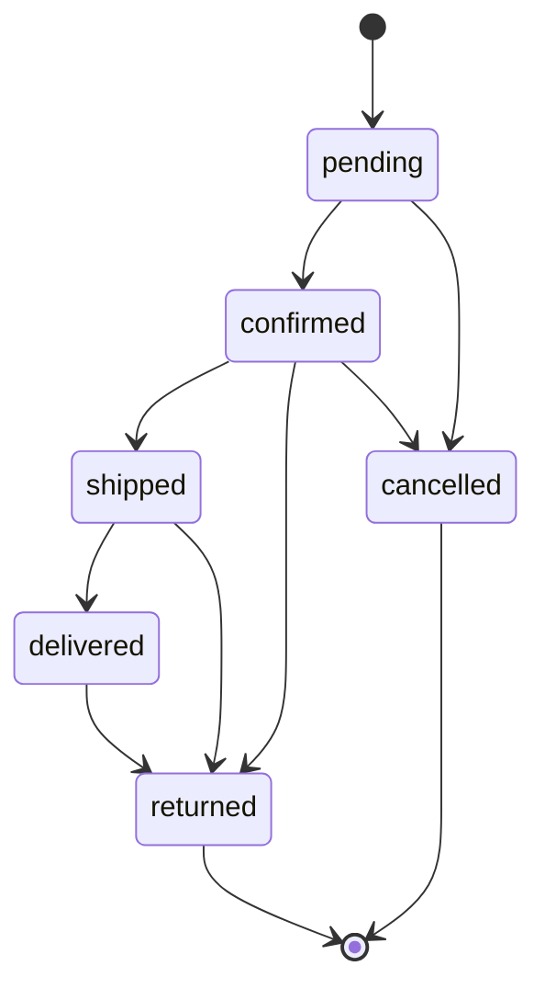
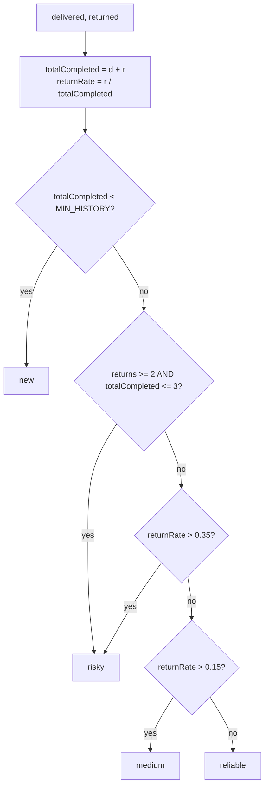

# 02 · Business Logic & Domain Rules

This is the heart of the system: the rules the software enforces, independent of UI. Everything here is implemented in code and, where it is a core differentiator, covered by tests. Pure, portable rules live in the [`shared/`](../shared/src) workspace so client, server, and tests all agree.

**Contents**
1. [Money & currency](#1-money--currency)
2. [Tenancy rule](#2-tenancy-the-single-most-important-rule)
3. [Customer identity resolution](#3-customer-identity-resolution)
4. [Order lifecycle & state machine](#4-order-lifecycle--state-machine)
5. [Order numbering](#5-order-numbering)
6. [COD risk scoring](#6-cod-risk-scoring)
7. [Product catalog & inventory](#7-product-catalog--inventory-products)
8. [Reminders / follow‑ups](#8-reminders--follow-ups)
9. [Messaging & rate limits](#9-messaging--rate-limits)
10. [Plan limits & quota enforcement](#10-plan-limits--quota-enforcement)
11. [Audit logging](#11-audit-logging)

---

## 1. Money & currency

- **Unit of storage:** all money is stored as an **integer number of paisa** (NPR × 100). Field names end in `Paisa` (`pricePaisa`, `totalPaisa`, `unitPricePaisa`, …).
- **Rationale:** avoids IEEE‑754 float rounding errors on sums of NPR amounts.
- **Conversion:** the API accepts/returns rupees at the edges (`priceNpr`, `unitPriceNpr`) and converts with `Math.round(npr * 100)` on the way in; the client divides by 100 for display and formats via `Intl.NumberFormat('en-NP')`.
- **No payment processing** happens anywhere. `paymentType` and `paymentReference` are *logged fields only*, for the seller's own reconciliation.

## 2. Tenancy: the single most important rule

Every business record belongs to exactly one **tenant** (a seller account).

- The tenant id is the **owner** seller's `_id`. Staff logins resolve their tenant to `parentSeller ?? _id` (exposed as `req.tenantId` after auth).
- **Every** query against tenant‑owned data (`orders`, `products`, `customers`, `conversations`, `messages`, `reminders`, `channels`, `activitylogs`) **must** include `seller: tenantId` in its filter.
- A cross‑tenant read or write is a bug, not a permission error. When a record isn't in the caller's tenant, the API returns **404 Not Found** (never "403 Forbidden") so existence isn't leaked.
- This is enforced by convention in every route + service and **proven by integration tests** ([`tenant.test.js`](../server/tests/tenant.test.js)).

## 3. Customer identity resolution

A **core differentiator.** Every conversation and order must resolve to a single customer profile so history rolls up. Implemented in [`identityService.js`](../server/src/services/identityService.js); pure phone logic in [`shared/src/phone.js`](../shared/src/phone.js). Unit‑tested in [`identity.test.js`](../server/tests/identity.test.js) and [`phone.test.js`](../server/tests/phone.test.js).

### 3.1 The identity key: phone number

- **Primary key:** a normalized phone number, scoped to the seller.
- **Secondary keys:** channel handles — Instagram user id, Facebook PSID — attached to the profile as `channelIdentities`.

### 3.2 Phone normalization rules (`normalizePhone`)

Pragmatic, Nepal‑first (not full libphonenumber):

1. Strip spaces, dashes, parentheses, dots.
2. A leading `00` becomes `+`.
3. A leading `+` is kept; the rest is reduced to digits.
4. A number already starting `977…` gets a `+`.
5. A bare **10‑digit** Nepali mobile starting `97`/`98` gets `+977` prepended.
6. Anything shorter than 7 digits → `null` (not a usable number).
7. Otherwise assume an international number missing its `+`.

Examples: `9812345678 → +9779812345678`, `(981) 234‑5678 → +9779812345678`, `00977… → +977…`.

### 3.3 Resolution flows

**A. From an inbound webhook (no phone yet):** `resolveByChannelIdentity`
- Look up an existing customer by `channelIdentities.externalUserId` within the tenant.
- If found, reuse it. If not, create a **provisional** customer (`isProvisional: true`) keyed on the channel handle. Inbound conversations are **never dropped**, even at the customer quota cap.

**B. From an order (phone supplied):** `resolveByPhone`
1. Normalize the phone. If it can't be normalized, fall back to the provisional conversation customer or create a bare provisional record.
2. **Existing phone‑keyed profile wins** — attach the new order + any new channel handle to it; if a provisional conversation customer also exists and differs, **fold it in** (merge identities/notes, re‑point its conversations & orders, delete the duplicate).
3. Otherwise, if the conversation had a provisional customer, **promote it in place**: set the phone, clear `isProvisional`. No duplicate is created.
4. Otherwise create a fresh phone‑keyed profile.

**Invariant:** a given (tenant, phone) resolves to exactly one surviving customer; provisional→phone promotion and folding are idempotent.

## 4. Order lifecycle & state machine

Statuses (`ORDER_STATUSES`): `pending · confirmed · shipped · delivered · returned · cancelled`.

Allowed transitions are declared in `ORDER_STATUS_TRANSITIONS` and validated server‑side; illegal jumps return **400**. Each transition appends to `statusHistory` `{from, to, at, by}` and is audit‑logged.

Rules:
- A new order always starts `pending`.
- `returned` and `cancelled` are terminal (no outgoing transitions).
- `delivered → returned` is allowed (a delivered item can still come back).
- **Completed** for risk purposes = `delivered` or `returned` (`COMPLETED_ORDER_STATUSES`).
- Confirming a **COD** order in the UI is gated behind a risk panel (see §6) — an intentional friction point, not a server rule.
- Any transition to `delivered`/`returned` triggers a recompute of the customer's risk cache.

## 5. Order numbering

- Human‑readable, **per‑seller sequential**: `DKN-000123` (prefix from `brand.orderPrefix`, zero‑padded to 6 digits).
- The next number is derived by taking the **highest existing order number** for the seller (sorted lexicographically on the zero‑padded string, which equals numeric order) and incrementing — **not** by most‑recent `createdAt`. This makes generation robust to out‑of‑order timestamps (e.g. seeded/backfilled data), avoiding duplicate‑key collisions on the unique `{seller, orderNumber}` index.

## 6. COD risk scoring

A **core differentiator.** Deterministic, rule‑based (**no ML**), computed **only** from *that seller's own* order history for the customer. Pure function `scoreCodRisk` in [`shared/src/risk.js`](../shared/src/risk.js); exhaustively unit‑tested in [`risk.test.js`](../server/tests/risk.test.js).

### 6.1 Inputs
Per customer, from the seller's orders: `deliveredOrders`, `returnedOrders`. Derived: `totalCompleted = delivered + returned`, `returnRate = returned / totalCompleted` (guarded so 0 completed → rate 0).

### 6.2 Thresholds (`RISK_CONFIG` — config constants, tunable without changing the rule shape)

| Constant | Default | Meaning |
|----------|---------|---------|
| `MIN_HISTORY` | 2 | Completed orders needed before scoring beyond "new". |
| `RELIABLE_MAX_RETURN_RATE` | 0.15 | ≤ this ⇒ reliable. |
| `MEDIUM_MAX_RETURN_RATE` | 0.35 | ≤ this (and > reliable) ⇒ medium. |
| `RISKY_ABSOLUTE_RETURNS` | 2 | ≥ this many returns … |
| `RISKY_ABSOLUTE_TOTAL` | 3 | … within ≤ this many completed orders ⇒ risky. |

### 6.3 Label decision (evaluated in order)

| Label | Tone | Meaning |
|-------|------|---------|
| `new` | neutral | Not enough history to score yet. |
| `reliable` | good | Low return rate — safe for COD. |
| `medium` | warn | Some returns — confirm before COD. |
| `risky` | bad | High return rate — consider prepaid. |

- The badge shows on the customer profile and inline in order confirmation, always accompanied by the **raw numbers** (past orders, returns, return %) so it is explainable, never a black box.
- `returnRate` is rounded to 3 decimals for display.
- Persisted as a denormalized `riskCache` on the customer, recomputed on order‑status changes and order creation; always consistent with current order data.
- COD risk is a **paid** feature (hidden on Free — see §10).

> The 4th tier (`medium`) was added on top of the original doc's "New/Reliable/Risky" for a more actionable signal; collapsing it back is a one‑line change to the rule.

## 7. Product catalog & inventory **[Products]**

A lightweight internal catalog — **not a storefront**. Rules implemented in [`products.routes.js`](../server/src/routes/products.routes.js) and [`orderService.js`](../server/src/services/orderService.js); tested in [`products.test.js`](../server/tests/products.test.js).

### 7.1 Product identity (SKU)
- Each product has a **SKU (product ID)**, **unique per seller**.
- If omitted at creation, a sequential SKU is auto‑generated: `DKN-P-000001…` (same robust highest‑value approach as order numbering).
- A duplicate SKU (custom or on edit) returns **409 `SKU_TAKEN`**.

### 7.2 Search
- One query searches **name OR SKU** (case‑insensitive, injection‑safe regex).
- Additional filters: category, status (`active`/`archived`/`all`), and a **low‑stock** filter.

### 7.3 Inventory (opt‑in per product)
- `trackInventory` toggles stock tracking. When off, the product is treated as **unlimited** (untracked).
- Stock states: **in‑stock**, **low‑stock** (`stock ≤ LOW_STOCK_THRESHOLD`, default **5**), **out‑of‑stock** (`stock == 0`).
- Stock can be adjusted by a **signed delta** (restock `+`, correction `−`), floored at 0. Adjusting a non‑tracked product is rejected (400).

### 7.4 Order integration (snapshot + rollup)
When an order line item links a product (`productId`):
- The product's **name and price are snapshotted** onto the order item (`productName`, `unitPricePaisa`, `sku`). Later product edits/archival **never** rewrite historical orders.
- On order creation: the product's `stats.unitsSold` and `stats.revenuePaisa` increment; if tracked, `stock` decrements by the ordered quantity (floored at 0).
- Free‑typed one‑off items (no `productId`) remain fully supported.

### 7.5 Soft delete
- "Deleting" a product **archives** it (`status: archived`). Order history and SKUs stay intact. Archived products drop out of the default list and the order picker but remain queryable.
- The product quota counts **active** products only, so archiving frees a slot.

## 8. Reminders / follow‑ups

- Date‑based tasks (e.g. "ping when new stock arrives"), optionally attached to a customer.
- Statuses: `open` → `done`. Completing sets `completedAt`.
- Surfaced on the dashboard: **due today** and **overdue** (`status: open AND dueAt ≤ now`).
- Part of the **CRM** paid feature set (gated on Free).

## 9. Messaging & rate limits

- Replies are composed inside the app and sent back through the **native Meta channel** (Messenger / Instagram messaging), so the customer experience is unchanged.
- Meta caps automated messages at **~200/hour/account**. Outbound sends go through an in‑memory **queue with a per‑channel sliding‑hour budget** ([`messageQueue.js`](../server/src/services/messageQueue.js)):
  - Under budget → send immediately, record the timestamp.
  - Over budget → **queue** (not drop); retry after a back‑off (~5 min).
  - Meta rate‑limit error codes (4, 17, 32, 613 / HTTP 429) → back off and retry.
  - Transient failures retry up to 3 times, then the message is marked `failed` (surfaced in the UI).
- Message status lifecycle: `queued → sent → delivered` (outbound) or `failed`; inbound arrive as `received`.

## 10. Plan limits & quota enforcement

Four tiers — **Free / Starter / Growth / Business** — differ by **usage limits** and a small set of **feature flags**; the feature *set* is otherwise constant across paid tiers (simpler to build/maintain solo, and mirrors the local market's model). See [09 · Pricing & Plans](./09-pricing-and-plans.md) for the full matrix and business rationale.

Enforcement is at the **data/API layer** so limits cannot be bypassed via the UI:
- `requireFeature(feature)` middleware gates: COD risk, dashboard, CRM writes, kanban board, CSV export. Returns **403 `PLAN_FEATURE_LOCKED`** with the `requiredPlan`.
- Quota middleware on create endpoints returns **403 `PLAN_QUOTA_EXCEEDED`**:
  - **Orders/month** — a rolling monthly counter on the seller (`orderCountThisPeriod`, reset lazily on month rollover).
  - **Customers** — count of tenant customers (manual create blocked at cap; inbound webhook customers are never blocked).
  - **Products** — count of **active** products.
  - **Channels** — active channel count; Free is additionally restricted to a single channel **type**.
- Fail‑safe: an unknown/missing plan is treated as **Free**. Downgrades never delete data; they only block new creates beyond the new cap.

## 11. Audit logging

Sensitive actions append to an `activitylogs` collection (best‑effort — logging never breaks the primary operation). Logged actions include: order created / status changed / updated, customer created / updated / note added / note edited, channel connected / disconnected, reminder created / completed, and product created / updated / archived. Each entry records the actor, target entity, a non‑secret metadata diff, and IP.
