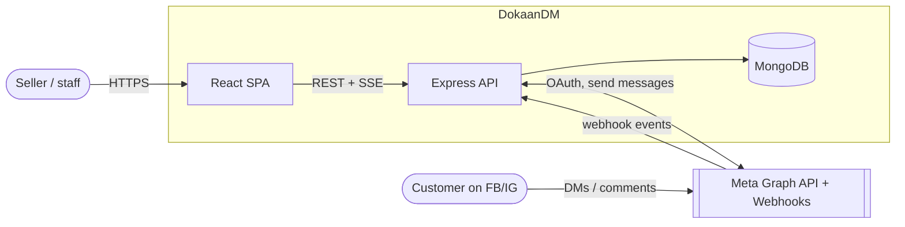
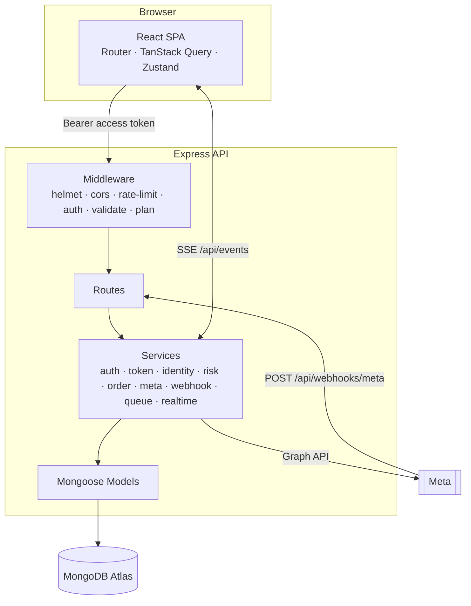
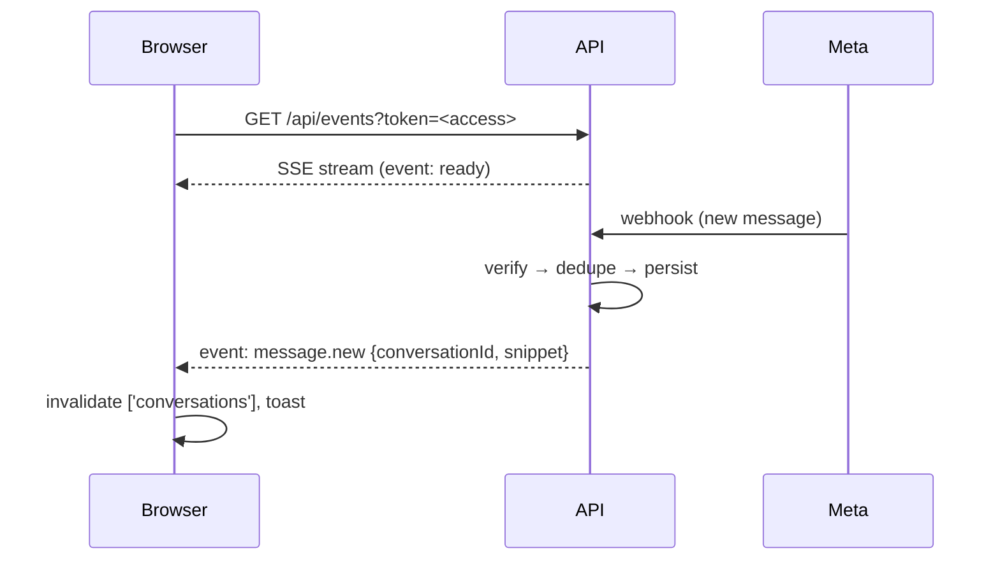
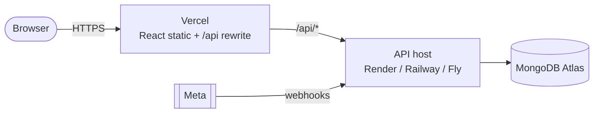
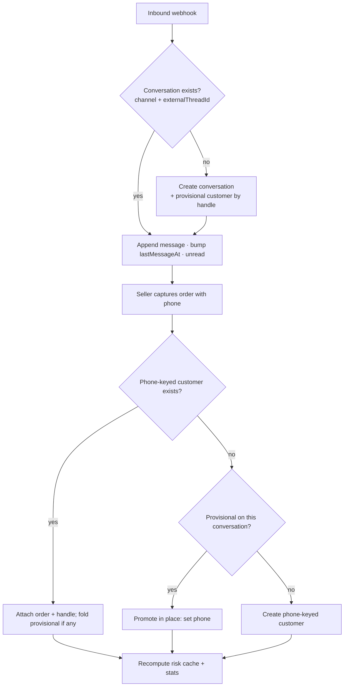

# 05 · System Architecture

## 1. Overview

DokaanDM is a **monorepo** with three npm workspaces and a classic three‑tier shape (SPA → API → database), plus two external integrations (Meta Graph API, and a browser real‑time channel via SSE).

```
DookanDM/
├── shared/   @dokaandm/shared — pure domain logic + Zod schemas + config (no I/O)
├── server/   @dokaandm/server — Express API, Mongoose models, services, Swagger
└── client/   @dokaandm/client — React (Vite) single‑page app
```

The `shared` package is the keystone: risk scoring, phone normalization, plan limits, enums, and validation schemas live there **once** and are imported by both the server and the client (and the tests), so all three can never drift.

## 2. Context diagram (C4 level 1)



## 3. Container diagram (C4 level 2)



## 4. Request lifecycle (server)

```mermaid
flowchart LR
  A[Request] --> B[helmet + compression]
  B --> C[request‑id + pino logging]
  C --> D[CORS allowlist]
  D --> E[body parse + raw‑body capture]
  E --> F[cookie parser]
  F --> G[rate limiter]
  G --> H[route: requireAuth?]
  H --> I[validate Zod?]
  I --> J[plan gate: requireFeature / enforceQuota?]
  J --> K[controller/service → Mongoose]
  K --> L[response envelope]
  L --> M{error?}
  M -- yes --> N[central error handler]
```



Key points:
- The **raw request body** is captured during JSON parsing so the webhook route can verify the `X‑Hub‑Signature‑256` HMAC.
- Success responses use a `{ data, … }` envelope; errors use `{ error: { code, message, details? } }`.
- The central error handler maps Mongoose/JWT errors to clean client responses and hides internals in production.

## 5. Backend module map

| Layer | Location | Responsibility |
|-------|----------|----------------|
| Config | `server/src/config/` | `env` (validated), `db`, `logger`, `swagger`. |
| Lib | `server/src/lib/` | `ApiError`, `http` (asyncHandler/envelope/pagination), `crypto` (AES/SHA), `cookies`, `sanitize`. |
| Middleware | `server/src/middleware/` | `auth`, `validate`, `plan`, `rateLimit`, `requestContext`, `error`. |
| Models | `server/src/models/` | 11 Mongoose models (see [06 · Data Model](./06-data-model.md)). |
| Services | `server/src/services/` | Business orchestration (see below). |
| Routes | `server/src/routes/` | HTTP surface + inline OpenAPI annotations. |

### Services
| Service | Responsibility |
|---------|----------------|
| `authService` | Register, authenticate, password re‑verify. |
| `tokenService` | JWT signing/verify, refresh issue/rotate/revoke, reuse detection. |
| `identityService` | Customer resolution by channel handle and by phone (merge/promote). |
| `riskService` | Compute + cache COD risk and rollup stats from orders. |
| `orderService` | Create orders (identity, numbering, product snapshot/stock, quota), status transitions. |
| `metaService` | Graph API wrapper: OAuth URL, token exchange, list pages, subscribe webhooks, send message, verify signature. |
| `webhookService` | Verify → dedupe → upsert conversation/message → resolve customer → publish. |
| `messageQueue` | Rate‑limited outbound send queue with back‑off. |
| `realtime` | In‑memory SSE broker, keyed by tenant. |
| `planService` | Usage counters, plan payload, monthly counter rollover. |
| `activityService` | Best‑effort audit logging. |

## 6. Frontend architecture

- **Build/routing:** Vite + React Router. App pages are **lazy‑loaded** (route‑level code splitting); auth pages load eagerly for fast first paint.
- **Server state:** TanStack Query (queries + mutations, cache invalidation, optimistic updates). All API access is centralized in `hooks/data.js`.
- **Client/UI state:** Zustand — `authStore` (session, access token in memory only) and `toastStore`.
- **Transport:** a single Axios instance (`lib/api.js`) attaches the access token, and on a 401 performs **one silent refresh** then retries; on failure it broadcasts logout.
- **Design system:** semantic CSS‑variable tokens (`--bg`, `--surface`, `--brand`, `--fg`, …) with light/dark themes and a selectable accent. Primitives in `components/ui/`, domain components in `components/common/`, feature modules in `features/`.
- **Real‑time:** `useRealtime` subscribes to `/api/events` (SSE) and invalidates the affected queries on `message.new`, `order.created`, etc., plus a toast for new inbound messages. (EventSource can't send headers, so the access token is passed as a query param and verified server‑side.)
- **Resilience:** a global `ErrorBoundary` catches render crashes.

### Client structure
```
client/src/
├── pages/          route screens (Login, Inbox, Orders, Products, Customers, Dashboard, Plan, …)
├── features/       feature modules (inbox/, orders/, products/)
├── components/
│   ├── ui/         design‑system primitives (Button, Input, Modal, Toaster, …)
│   ├── common/     domain badges (RiskBadge, ChannelBadge, StatusBadge, UpgradeGate, Avatar)
│   ├── layout/     AppShell, AuthLayout, PageHeader
│   └── brand/      Logo, social flourishes
├── hooks/          data.js (all queries/mutations), useSession, useRealtime, useDebounced
├── store/          Zustand stores
└── lib/            api, cn, format, queryClient
```

## 7. Real‑time (SSE) design



The SSE broker is **in‑memory** and keyed by tenant id, so multi‑tab sellers all receive events and no event ever crosses tenants. For horizontal scale this becomes a shared pub/sub (see [ADR‑006](./14-architecture-decision-records.md)).

## 8. Deployment topology



The client is served statically; a rewrite proxies `/api/*` to the API so the browser talks to one origin (keeps the refresh cookie same‑origin). See [11 · Deployment & Operations](./11-deployment-operations.md).

## 9. Data flow: message → order → customer → risk


