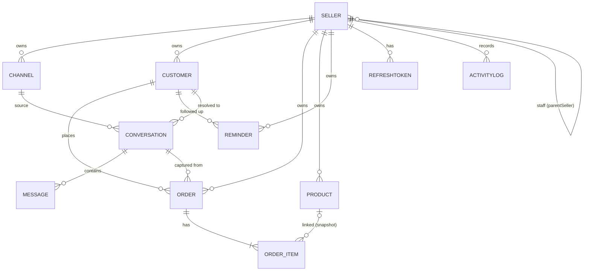

# 06 · Data Model

MongoDB via Mongoose. Conventions:

- Every tenant‑owned document carries `seller` (ObjectId → `Seller`, indexed) — the tenant key.
- Timestamps (`createdAt`/`updatedAt`) via Mongoose `{ timestamps: true }`.
- Money is integer **paisa**.
- Secrets (`passwordHash`, `pageAccessTokenEnc`) use `select:false`.
- 11 collections: `sellers`, `refreshtokens`, `channels`, `customers`, `conversations`, `messages`, `orders`, `products`, `reminders`, `activitylogs`, `webhookevents`.

## Entity relationships

---

## `sellers`
Tenant + user account. Staff share their owner's tenant.

| Field | Type | Req | Default | Notes |
|-------|------|-----|---------|-------|
| `fullName` | String | ✔ | | |
| `businessName` | String | ✔ | | |
| `email` | String | ✔ | | lowercase, **unique** |
| `phone` | String | ✖ | | |
| `passwordHash` | String | ✔ | | bcrypt, `select:false` |
| `plan` | enum `free\|starter\|growth\|business` | ✔ | `free` | |
| `planStatus` | enum `active\|past_due\|canceled` | ✔ | `active` | payment out of scope |
| `planRenewsAt` | Date | ✖ | | informational |
| `orderCountThisPeriod` | Number | ✔ | 0 | monthly quota counter |
| `orderCountPeriodStart` | Date | ✔ | now | resets monthly |
| `role` | enum `owner\|staff` | ✔ | `owner` | |
| `parentSeller` | ObjectId→Seller | ✖ | null | staff → owner tenant |
| `lastLoginAt` | Date | ✖ | | |
| `isActive` | Boolean | ✔ | true | |

**Virtual** `tenantId` = `parentSeller ?? _id`. **Method** `toSafeJSON()` strips the hash.
**Indexes:** `{email}` unique; `{parentSeller}`.

## `refreshtokens`
Rotating refresh tokens with family‑based reuse detection.

| Field | Type | Notes |
|-------|------|-------|
| `seller` | ObjectId | indexed |
| `tokenHash` | String | SHA‑256 of the raw token; **unique**. Raw token never stored. |
| `family` | String | rotation family id |
| `expiresAt` | Date | **TTL index** (auto‑purge) |
| `revokedAt` | Date | set on rotate/logout/revoke |
| `replacedBy` | String | successor's tokenHash |
| `userAgent`, `ip` | String | audit |

**Indexes:** `{tokenHash}` unique; `{expiresAt}` TTL; `{seller, family}`.

## `channels`
A connected Facebook Page or Instagram business account.

| Field | Type | Notes |
|-------|------|-------|
| `seller` | ObjectId | tenant |
| `type` | enum `facebook\|instagram` | |
| `externalId` | String | FB Page id / IG account id |
| `name` | String | display name |
| `pageAccessTokenEnc` | String | **AES‑256‑GCM encrypted**, `select:false` |
| `tokenExpiresAt` | Date | scheduled refresh |
| `igLinkedPageId` | String | IG's backing FB page |
| `webhookSubscribed` | Boolean | |
| `status` | enum `active\|disconnected\|error` | |
| `scopes` | [String] | granted permissions |

**Method** `toSafeJSON()` strips the token. **Indexes:** `{seller,type}`; `{seller,status}`; `{externalId,type}` unique.

## `customers`
Phone‑keyed CRM profile (identity resolution target).

| Field | Type | Notes |
|-------|------|-------|
| `seller` | ObjectId | tenant |
| `name` | String | best‑known name |
| `phones` | [String] | normalized; **primary identity** |
| `channelIdentities` | [{channel, type, externalUserId, handle}] | secondary keys |
| `tags` | [String] | VIP/risky/regular/… |
| `notes` | [{body, createdAt, editedAt}] | |
| `isProvisional` | Boolean | true until a phone is known |
| `riskCache` | {label, totalCompleted, deliveredOrders, returnedOrders, returnRate, computedAt} | denormalized COD risk |
| `stats` | {totalOrders, lifetimeValuePaisa, lastOrderAt} | denormalized rollups |

**Critical indexes:**
- `{seller, phones}` — **the identity‑resolution index** (multikey).
- `{seller, "channelIdentities.externalUserId"}` — resolve provisional customers from webhook handles.
- `{seller, tags}`; `{seller, createdAt}`; `{seller, name:"text"}`.

## `conversations`
A normalized FB/IG thread.

| Field | Type | Notes |
|-------|------|-------|
| `seller` | ObjectId | tenant |
| `channel` | ObjectId→Channel | |
| `channelType` | enum | denormalized for fast filter |
| `kind` | enum `dm\|comment` | |
| `externalThreadId` | String | Meta thread/participant id |
| `customer` | ObjectId→Customer | resolved participant |
| `participantHandle` / `participantExternalId` | String | @handle / PSID‑IG id |
| `lastMessageAt` | Date | sort key |
| `lastMessageSnippet` / `lastMessageDirection` | | list preview |
| `unread` / `unreadCount` | Boolean / Number | |
| `status` | enum `open\|archived` | |
| `hasOrder` | Boolean | filter flag |

**Indexes:** `{seller, lastMessageAt:-1}` (inbox list); `{channel, externalThreadId}` **unique** (webhook upsert); `{seller, unread, lastMessageAt}`; `{seller, channelType, lastMessageAt}`; `{customer}`.

## `messages`

| Field | Type | Notes |
|-------|------|-------|
| `seller` | ObjectId | tenant |
| `conversation` | ObjectId→Conversation | indexed |
| `channelType` | enum | |
| `direction` | enum `inbound\|outbound` | |
| `externalMessageId` | String | Meta message id (dedupe) |
| `text` | String | |
| `attachments` | [{type, url}] | |
| `senderExternalId` | String | |
| `status` | enum `received\|queued\|sent\|delivered\|failed` | |
| `error` | String | on failed send |
| `sentAt` | Date | |

**Indexes:** `{conversation, createdAt}` (thread render); `{externalMessageId}` unique‑sparse (idempotent webhook); `{seller, text:"text"}`.

## `orders`

| Field | Type | Notes |
|-------|------|-------|
| `seller` | ObjectId | tenant |
| `orderNumber` | String | per‑seller `DKN‑000123` |
| `customer` | ObjectId→Customer | |
| `conversation` | ObjectId→Conversation | source thread |
| `channelType` | String | origin |
| `items` | [{product?, sku?, productName, qty, unitPricePaisa}] | ≥1; **[Products]** optional product link + snapshot |
| `subtotalPaisa` / `shippingPaisa` / `totalPaisa` | Number | |
| `paymentType` | enum `cod\|esewa\|khalti\|bank_transfer` | logged only |
| `paymentReference` | String | reconciliation |
| `phone` | String | drives identity resolution |
| `address` | String | |
| `status` | enum (see [02 §4](./02-business-logic.md#4-order-lifecycle--state-machine)) | |
| `statusHistory` | [{from, to, at, by}] | |
| `notes` | String | |

**Indexes:** `{seller, createdAt:-1}` (list); `{seller, status, createdAt}` (pipeline); `{customer, createdAt}` (history rollup); `{seller, orderNumber}` unique; `{seller, paymentType, status}` (COD‑pending card).

## `products` **[Products]**

| Field | Type | Notes |
|-------|------|-------|
| `seller` | ObjectId | tenant |
| `name` | String | |
| `sku` | String | product ID; **unique per seller**; auto `DKN‑P‑000001…` |
| `pricePaisa` | Number | |
| `costPaisa` | Number | optional, for margin |
| `category` / `description` / `imageUrl` | String | |
| `trackInventory` | Boolean | opt‑in |
| `stock` | Number | when tracked |
| `status` | enum `active\|archived` | archive = soft delete |
| `stats` | {unitsSold, revenuePaisa} | incremented at order capture |

**Indexes:** `{seller, sku}` **unique** (product‑ID search + dedupe); `{seller, status, createdAt}`; `{seller, name:"text"}`; `{seller, category}`.

## `reminders`

| Field | Type | Notes |
|-------|------|-------|
| `seller` | ObjectId | tenant |
| `customer` | ObjectId→Customer | optional |
| `title` | String | |
| `dueAt` | Date | |
| `status` | enum `open\|done` | |
| `completedAt` | Date | |

**Indexes:** `{seller, status, dueAt}` (dashboard due list); `{customer}`.

## `activitylogs` (audit)

| Field | Type | Notes |
|-------|------|-------|
| `seller` | ObjectId | tenant |
| `actor` | ObjectId→Seller | who |
| `action` | String | e.g. `order.status_changed` |
| `entityType` / `entityId` | String / ObjectId | target |
| `meta` | Mixed | non‑secret diff |
| `ip` | String | |

**Indexes:** `{seller, createdAt:-1}`; `{entityType, entityId}`.

## `webhookevents` (idempotency + replay safety)

| Field | Type | Notes |
|-------|------|-------|
| `dedupeKey` | String | Meta event id / hash; **unique** |
| `channelType` | String | |
| `status` | enum `pending\|processed\|failed` | |
| `processedAt` / `error` | | |
| `payload` | Mixed | raw, for replay/debug |
| `expiresAt` | Date | **TTL index** (~7 days) |

**Indexes:** `{dedupeKey}` unique; `{expiresAt}` TTL.

---

## Index rationale (query → index)

| Query pattern | Index used |
|---------------|-----------|
| Inbox list (newest first) | `conversations {seller, lastMessageAt:-1}` |
| Webhook upsert a thread | `conversations {channel, externalThreadId}` unique |
| Resolve customer by phone | `customers {seller, phones}` |
| Resolve provisional by handle | `customers {seller, channelIdentities.externalUserId}` |
| Order pipeline / board | `orders {seller, status, createdAt}` |
| COD‑pending dashboard card | `orders {seller, paymentType, status}` |
| Per‑customer history + risk | `orders {customer, createdAt}` |
| Product search by name/SKU | `products {seller, name:"text"}` + `{seller, sku}` |
| Reminders due/overdue | `reminders {seller, status, dueAt}` |
| Auth refresh lookup | `refreshtokens {tokenHash}` unique |
