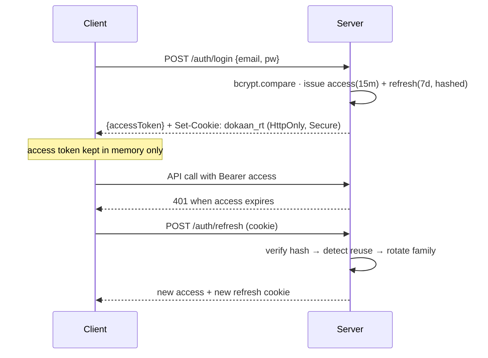

# 08 · Security

Security is designed in, not bolted on. This document covers authentication, the controls in place, the threat model, and secrets handling.

## 1. Authentication & session model

- **Passwords:** bcrypt with cost factor **12**. Hashes are stored `select:false` and never returned or logged. Login runs bcrypt even on unknown emails to avoid user‑enumeration timing differences.
- **Access token:** short‑lived JWT (~15 min), sent as `Authorization: Bearer`. Held **in memory** on the client (never `localStorage`), so it isn't exposed to persistent XSS token theft.
- **Refresh token:** opaque random string, **~7 days**, delivered as an **httpOnly, Secure, SameSite** cookie scoped to `/api/auth`. Only its **SHA‑256 hash** is stored server‑side — the raw value is never persisted.
- **Rotation + reuse detection:** every refresh **rotates** the token (old one marked replaced). Presenting an already‑consumed/revoked token is treated as **theft**: the entire token **family** is revoked. Verified by `auth.test.js`.
- **Logout** revokes the presented refresh token. Expired tokens auto‑purge via a MongoDB **TTL index**.
- **Step‑up:** `/auth/verify-password` re‑confirms the current password before sensitive account changes.

### Login + refresh sequence

## 2. Transport & headers

- **Helmet** sets HTTP security headers (HSTS, no‑sniff, frameguard, etc.).
- **CORS** is an explicit allowlist (`CORS_ORIGINS`) with credentials enabled — **no wildcard origins**. A disallowed origin gets `403 CORS_DENIED`.
- `trust proxy` is enabled so Secure cookies, `req.ip`, and rate limiting work correctly behind a PaaS proxy. Production must run behind **HTTPS** (`COOKIE_SECURE=true`).

## 3. Input validation & injection defense

- **Every** request body/query is validated by **Zod** (`validate` middleware) and reduced to primitives before it touches a query.
- **NoSQL operator injection:** Express can parse `?x[$ne]=` into objects; direct query‑param filters are `String()`‑coerced, so a crafted operator can't reach the query. User‑supplied search text goes through `escapeRegex` and `mongoose.trusted({$regex})`. The global `sanitizeFilter` flag is deliberately **off** because it non‑deterministically broke legitimate operator queries — see [ADR‑007](./14-architecture-decision-records.md). Regression‑guarded by `search.test.js`.
- **Mongoose casting** rejects malformed ids (`CastError → 400`).

## 4. Webhook security

- Every `POST /api/webhooks/meta` is verified against **`X‑Hub‑Signature‑256`** (HMAC‑SHA256 of the raw body with the app secret). Unverified payloads are rejected with **401** and logged.
- The raw body is preserved during JSON parsing specifically to compute this HMAC.
- Processing is **idempotent** (deduped by Meta message id in `webhookevents`), so replays/duplicates are safe.
- The webhook endpoint is **rate‑limited** to blunt floods; it acks 200 immediately and processes asynchronously.

## 5. Secrets & encryption at rest

- **Meta OAuth page tokens** are the most sensitive stored data. They are encrypted with **AES‑256‑GCM** (`lib/crypto.js`) using `TOKEN_ENCRYPTION_KEY` (32‑byte hex), stored as `iv || authTag || ciphertext` (base64), and the field is `select:false`.
  - ⚠️ **Losing `TOKEN_ENCRYPTION_KEY` makes stored Meta tokens undecryptable.** Back it up in a secrets manager, separate from DB backups.
- **JWT secrets** (`JWT_ACCESS_SECRET`, `JWT_REFRESH_SECRET`) are separate, ≥ 32 bytes each.
- No secrets are committed. `server/.env.example` documents every variable; `env.js` validates them at boot and refuses to start on invalid config.
- Logs **redact** authorization headers, cookies, passwords/hashes, and access tokens.

## 6. Multi‑tenant isolation

- Every tenant‑owned query is scoped to `req.tenantId`. Foreign records return **404** (existence not leaked).
- SSE events are published only to the owning tenant's connected clients.
- Proven by `tenant.test.js` (seller B cannot read/modify/enumerate seller A's orders or customers).

## 7. Rate limiting

| Scope | Window | Cap |
|-------|--------|-----|
| Auth (login/register/refresh/verify) | 15 min | 30 |
| Webhook receiver | 1 min | 600 |
| General API | 1 min | 300 |

(Disabled in the test environment.) For horizontal scale, back the limiter with a shared store (Redis).

## 8. Threat model (STRIDE, abbreviated)

| Threat | Vector | Mitigation |
|--------|--------|------------|
| **Spoofing** | Forged webhook, stolen token | HMAC signature check; short access token in memory; rotating refresh with reuse detection. |
| **Tampering** | NoSQL injection, param pollution | Zod + `String()` coercion + escaped regex; Mongoose casting. |
| **Repudiation** | "I didn't change that order" | Audit log of sensitive actions with actor + IP + diff. |
| **Information disclosure** | Cross‑tenant read, error leakage, token at rest | Tenant scoping + 404; prod error handler hides internals; AES‑256‑GCM token encryption; log redaction. |
| **Denial of service** | Auth brute force, webhook flood | Rate limiting; async webhook ack; pagination caps. |
| **Elevation of privilege** | Free user hitting paid endpoints | `requireFeature`/`enforceQuota` middleware server‑side (UI gating is not the control). |

## 9. Known limitations / follow‑ups

- No email verification / password‑reset flow yet (single‑user pilot scope).
- Rate limiter and SSE broker are in‑process (single‑instance assumption for MVP).
- No field‑level encryption beyond Meta tokens; PII (names/phones) is protected by tenancy + transport security, not at‑rest encryption.
- CSRF: refresh cookie is `SameSite` + scoped to `/api/auth`, and state‑changing endpoints require the Bearer access token (not the cookie), which mitigates CSRF; a same‑site deployment is recommended.
