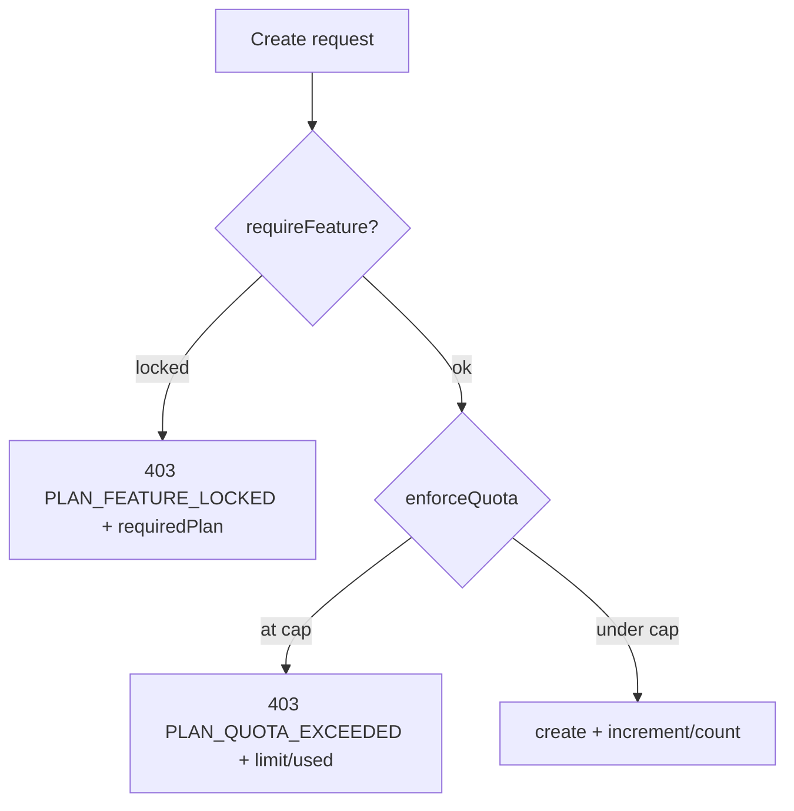

# 09 · Pricing & Plan Enforcement

Payment collection is **out of MVP scope** — plans are assigned manually while validating with pilot sellers. But the **limits are real and enforced in code**, so the product behaves exactly as it will once billing is added. Definitions live in [`shared/src/plans.js`](../shared/src/plans.js).

## 1. Market context & business rationale

- **Anchor price:** the direct Nepal competitor (Saney) starts around **NPR 2,499/month**; the Indian regional benchmark (Interakt et al.) is INR 2,499–2,799/month **plus** Meta conversation fees. So ~NPR 2,500/month is the established entry anchor.
- **Cost advantage:** DokaanDM has no storefront hosting, no AI inference, and no payment gateway to maintain → structurally cheaper to run → it should land **meaningfully below** the anchor, not marginally under it. NPR 899 reads as clearly different; NPR 2,200 would not.
- **Clean flat subscription:** with no payment gateway there's no transaction‑fee revenue lever, so pricing is a simple flat subscription. **Zero service/transaction fees** is itself a selling point against competitors that take a cut of processed payments.
- **Differentiate by limits, not features:** the paid tiers share the same feature set and differ by **usage limits** (mirrors the market model and is far simpler to build/maintain solo). The **Free** tier is the exception — it is deliberately thin (see below).
- **Annual = 2 months free** — matches the local market's mental model.

## 2. The tiers

| | **Free** | **Starter** | **Growth** | **Business** |
|---|---|---|---|---|
| Price | NPR 0 | **NPR 899/mo** (8,990/yr) | **NPR 1,799/mo** (17,990/yr) | Custom |
| vs. anchor (2,499) | — | ~64% cheaper | ~28% cheaper | — |
| Channels | 1 (FB **or** IG) | FB + IG (2) | up to 3 | unlimited |
| Orders / month | 40 | 300 | 1,500 | unlimited |
| Customer profiles | 25 | 500 | unlimited | unlimited |
| **Products** | **25** | **300** | **2,000** | **unlimited** |
| Order pipeline | basic (list) | full (kanban + filters) | full | full |
| CRM notes/tags/reminders | — | ✔ | ✔ | ✔ |
| COD risk flagging | — | ✔ | ✔ | ✔ |
| Business dashboard | — | ✔ | ✔ | ✔ |
| CSV export | — | ✔ | ✔ | ✔ |
| Team logins | 1 | 1 | up to 3 | unlimited |
| Support | Community 48–72h | Email 24–48h | Priority same‑day | Dedicated |
| Transaction/service fees | none | none | none | none |

### Why each tier is shaped this way
- **Free** is intentionally thin — one channel, no COD‑risk badge, no dashboard, no CRM — so it's usable during the Meta 25‑account test window and pilot recruitment, while the **core differentiators stay behind the paywall** to actually measure willingness to pay.
- **Starter** is the plan that matters most: the first tier where **FB + IG are unified together** (the core value prop), priced for a true solo seller. 300 orders/month comfortably covers the "15–20 active custom orders" pain point.
- **Growth** targets sellers who've outgrown solo — multiple pages/sub‑brands, a hired helper (hence 3 logins), higher volume.
- **Business** stays "contact us" — no need to build custom‑limit UI for what's likely 1–2 sellers in year one.

## 3. Feature flags (`FEATURES`)

Gated capabilities (all included on every paid tier, none on Free):

| Flag | Gates |
|------|-------|
| `cod_risk` | COD risk badge + `/customers/:id/risk`. |
| `dashboard` | `/dashboard/*`. |
| `crm` | Notes, tags writes, reminders. |
| `kanban` | Full order board + filters (Free gets a basic list). |
| `csv_export` | Orders & products CSV export. |

## 4. How limits are enforced (data/API layer)

Enforcement is **server‑side middleware**, so limits hold regardless of the UI. Encoded as `PLAN_LIMITS[plan] = { channels, ordersPerMonth, customers, products, teamLogins, features:Set, … }` with `Infinity` = unlimited.

| Resource | Enforcement |
|----------|-------------|
| **Orders/month** | `seller.orderCountThisPeriod` vs `ordersPerMonth`; counter rolls over lazily on month boundary; atomic `$inc` on create. |
| **Customers** | `countDocuments({seller})` vs `customers`. Manual create blocked at cap; **inbound webhook customers are never blocked** (conversations must never be dropped). |
| **Products** | `countDocuments({seller, status:active})` vs `products`. Archiving frees a slot. |
| **Channels** | active channel count vs `channels`; Free additionally limited to a single channel **type**. |
| **Team logins** | staff count vs `teamLogins`. |
| **Features** | `requireFeature(flag)` on the gated routes. |

**Fail‑safe:** unknown/missing plan ⇒ treated as **Free**. Downgrades never delete data; they only block new creates beyond the new cap.

## 5. Live usage & UI treatment

- `GET /plan` returns `{ plan, limits, usage:{ channels, ordersThisPeriod, customers, products, teamLogins } }`.
- The UI shows **meters** (green → amber ≥ 80% → red ≥ 90%), renders locked features as an **upgrade state** (never a broken screen), and shows an "Upgrade" CTA at the cap. No payment flow — the CTA is informational for the pilot.

## 6. Launch tactics (tied to validation)

- **Founding Seller rate:** 50% off Starter for the first 3 months for the 5–10 pilot sellers, in exchange for structured willingness‑to‑pay feedback — converts the validation cohort into the first paying cohort without discounting the public price.
- **A/B the Starter price** during the pilot: split sellers across **NPR 799 vs NPR 999** when asking the willingness‑to‑pay question, to get a real data point before locking a public price.

> Revisit the whole tier structure once any fast‑follow ships (WhatsApp, AI reply, payment gateway) — those open new monetization levers (e.g. transaction fees once a payment gateway lands).
