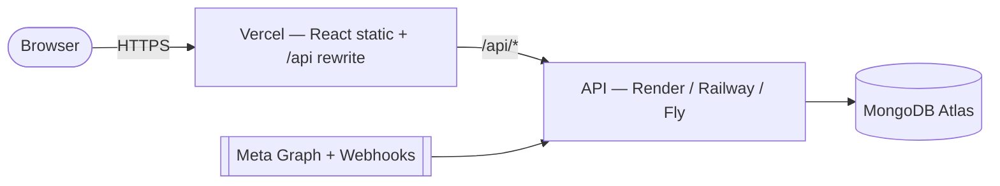

# 11 · Deployment & Operations

This expands the root [`DEPLOYMENT.md`](../DEPLOYMENT.md) into an operations reference: environments, deploy steps, the Meta setup, a runbook, observability, and scaling notes.

## 1. Environments

| Env | DB | Meta | Cookies | Notes |
|-----|----|----|---------|-------|
| **Local dev** | local `mongod` | usually unconfigured (seed data) | `Secure=false`, `SameSite=lax` | `npm run dev`, seed data. |
| **Test** | in‑memory Mongo | `META_TEST_MODE=true` | n/a | Vitest only. |
| **Pilot / prod** | MongoDB Atlas | configured, `META_TEST_MODE=true` until App Review clears | `Secure=true` | Behind HTTPS. |

## 2. Topology

## 3. Deploy steps (summary)

**Database — MongoDB Atlas:** create a cluster + DB user; allowlist the API host egress; `MONGO_URI = …/dokaandm`. Indexes auto‑create on first connect.

**API — Render/Railway/Fly:** deploy from repo root, Build `npm install`, Start `npm start -w server`. Set every env var (see §5). Verify `GET /api/health` → `{status:"ok"}`.

**Client — Vercel:** Root = repo root, Build `npm install && npm run build -w client`, Output `client/dist`. Add a rewrite so `/api/*` → the API host (keeps the refresh cookie same‑origin). `client/vercel.json` already provides the SPA fallback.

> **Cross‑site cookies:** if API and client are on different registrable domains, set `COOKIE_SAMESITE=none` + `COOKIE_SECURE=true`. Putting both behind one apex domain (`app.` + `api.`) is simpler and more robust.

## 4. Meta app + webhook (critical path — start early)

1. Create a **Business‑type** Meta app; add **Facebook Login for Business**, **Instagram Graph API**, **Messenger**.
2. Complete **Business Verification** (required for Advanced Access).
3. OAuth redirect URI must exactly equal `META_OAUTH_REDIRECT_URI` = `https://<api-host>/api/channels/oauth/callback`.
4. Webhook: callback `https://<api-host>/api/webhooks/meta`, verify token = `META_WEBHOOK_VERIFY_TOKEN`, subscribe fields `messages, messaging_postbacks, feed, comments`.
5. **App Review:** submit `instagram_business_manage_messages` (+ related) with a screencast. Until approved, use the **25‑account test allowance** (`META_TEST_MODE=true`) to pilot.

## 5. Environment variables (server)

| Variable | Required | Notes |
|----------|----------|-------|
| `NODE_ENV` | ✔ | `production` in prod. |
| `PORT` | ✔ | Provided by host. |
| `CORS_ORIGINS` | ✔ | Comma‑separated allowlist; **no wildcards**. |
| `MONGO_URI` | ✔ | Atlas connection string. |
| `JWT_ACCESS_SECRET` / `JWT_REFRESH_SECRET` | ✔ | `openssl rand -hex 32` each. |
| `JWT_ACCESS_TTL` / `JWT_REFRESH_TTL_DAYS` | ✖ | Defaults 15m / 7d. |
| `COOKIE_SECURE` / `COOKIE_SAMESITE` / `COOKIE_DOMAIN` | ✔/✖ | `true`/`none` cross‑site in prod. |
| `TOKEN_ENCRYPTION_KEY` | ✔ | **64 hex chars (32 bytes)**. Back it up. |
| `META_APP_ID` / `META_APP_SECRET` | ✖ | Blank → offline dev mode. |
| `META_GRAPH_VERSION` | ✖ | e.g. `v21.0`. |
| `META_OAUTH_REDIRECT_URI` / `META_OAUTH_SCOPES` | ✖ | Must match Meta app config. |
| `META_WEBHOOK_VERIFY_TOKEN` | ✔(with Meta) | You choose; must match Meta. |
| `META_TEST_MODE` | ✖ | `true` while piloting (≤25 accounts). |
| `META_MESSAGE_RATE_LIMIT_PER_HOUR` | ✖ | Default 200. |
| `CLIENT_URL` | ✔ | For OAuth success redirect. |
| `LOG_LEVEL` | ✖ | `info` default. |

`env.js` validates all of these at boot and **refuses to start** on invalid config.

## 6. Post‑deploy checklist

- [ ] `GET /api/health` → `200 {status:"ok", db:"connected"}`.
- [ ] `GET /api/docs` loads Swagger.
- [ ] Register + login; refresh cookie is `HttpOnly; Secure`.
- [ ] CORS allows only your client origin(s).
- [ ] `TOKEN_ENCRYPTION_KEY` is 64 hex chars and **backed up**.
- [ ] Secrets set via the host's env store — never committed.
- [ ] Meta webhook verification handshake succeeded.
- [ ] Seed **not** run against production.

## 7. Runbook (common incidents)

| Symptom | Likely cause | Action |
|---------|--------------|--------|
| `/api/health` → 503 | DB unreachable | Check Atlas status, IP allowlist, `MONGO_URI`. |
| Login works, but calls 401 after ~15 min and don't recover | Refresh cookie not reaching API (cross‑site) | Set `COOKIE_SAMESITE=none` + `COOKIE_SECURE=true`, or serve client+API same‑origin. |
| CORS errors in browser console | Origin not allowlisted / port changed | Add the exact origin to `CORS_ORIGINS`, redeploy (env isn't hot‑reloaded). |
| Webhooks not arriving | Verify handshake failed / not subscribed | Re‑run Meta webhook verification; confirm page `subscribed_apps` fields. |
| Webhook 401s | Signature mismatch | Confirm `META_APP_SECRET` matches the app; ensure the raw body reaches the verifier (no proxy re‑encoding). |
| Replies stuck "queued" | Rate cap hit or Meta error | Expected over 200/hr — drains automatically; check logs for Meta error codes. |
| Meta tokens fail to decrypt | `TOKEN_ENCRYPTION_KEY` changed/lost | Restore the original key; if truly lost, sellers must reconnect channels. |
| Duplicate‑key on order/product create | (fixed) non‑monotonic numbering | Numbering now sorts by number, not date — ensure server is up to date. |
| Port 4000 EADDRINUSE locally | Stale dev server | Find + stop the process (`lsof -i :4000`). |

## 8. Observability

- **Logs:** structured JSON via **pino**, one line per request, with a correlation id (`x-request-id`, echoed in the response header). Secrets/tokens are redacted. Pipe host logs to your aggregator.
- **Levels:** client errors log at `warn`, server errors at `error`, health checks are not logged.
- **Health:** `/api/health` reports DB state, Meta configured/test‑mode flags, and uptime — wire it to your uptime monitor.
- **Audit:** `activitylogs` records sensitive actions (queryable via `/api/activity`).

## 9. Backups & data

- Enable **Atlas automated backups**.
- Keep `TOKEN_ENCRYPTION_KEY` in a **secrets manager separate from DB backups** (a backup without the key can't decrypt Meta tokens; the key without a backup is useless — keep both, apart).
- TTL indexes auto‑expire refresh tokens and webhook‑event records.

## 10. Scaling notes (when the MVP outgrows one instance)

The MVP is a single API instance. Two components assume that and are the seams to change first:

1. **Outbound message queue** (`messageQueue.js`) is in‑process. Move to a durable queue (**BullMQ + Redis**) for multiple instances / ret' durability.
2. **SSE broker** (`realtime.js`) is in‑memory per instance. Move to a shared pub/sub (**Redis**) so events fan out across instances.

Also: back the **rate limiter** with Redis, and consider read replicas / careful indexing for the inbox list and dashboard aggregations at high volume.
